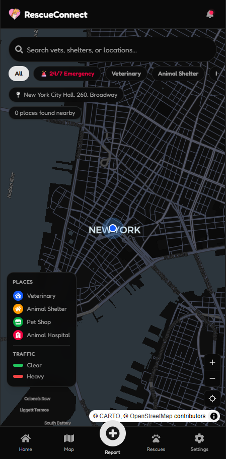

<div align="center">
  
  <h1>Animal Rescue Connect</h1>
  <p><strong>Emergency help platform for stray & sick animals — report, locate, rescue.</strong></p>

<p>
    
    
    
    
    
  </p>

<p>
    <a href="https://animal-rescue-seven.vercel.app" target="_blank"><strong>🚀 Live Demo</strong></a>
     · 
    <a href="https://github.com/CoderGUY47/animal-rescue" target="_blank"><strong>📂 Repository</strong></a>
  </p>
</div>

---

## 📸 Screenshots

<div align="center">
  
   
  
   
  
</div>

---

## 📖 About

**Animal Rescue Connect** is a mobile-first web application that bridges the gap between people who spot injured or abandoned animals and the local volunteers, vets, and shelters who can help them. It was built to feel like a native app — instant, responsive, and always within reach.

---

## ✨ Features

| Feature                         | Description                                                                         |
| ------------------------------- | ----------------------------------------------------------------------------------- |
| 🚨**Emergency Reporting** | Submit a rescue request with animal type, severity, condition, location, and photos |
| 🗺️**Interactive Map**   | Find nearby vets, shelters, pet shops & hospitals using live OpenStreetMap data     |
| 🔍**Location Search**     | Search any location and get directions with colour-coded traffic routing            |
| 🐾**Rescue Tracker**      | Browse and track all active rescue cases in real time                               |
| 📊**Analytics Dashboard** | Community-wide rescue stats, adoption rates, and response time charts               |
| 🤝**Volunteer Sign-Up**   | Register as a volunteer with your skills and availability                           |
| 🔔**Notifications**       | In-app notification centre for rescue alerts and updates                            |
| ⚙️**Settings**          | Manage your profile, privacy, location sharing, and notification preferences        |
| 🌙**Dark / Light Mode**   | System-aware theme that can be overridden manually                                  |

---

## 🛠️ Tech Stack

### Frontend

- **[Next.js 16](https://nextjs.org/)** — App Router, server components, and static generation
- **[React 19](https://react.dev/)** — Latest concurrent features
- **[TypeScript 5](https://www.typescriptlang.org/)** — Strict type safety throughout
- **[Tailwind CSS 4](https://tailwindcss.com/)** — Utility-first responsive styling
- **[shadcn/ui](https://ui.shadcn.com/)** — Accessible, composable component primitives

### State & Forms

- **[Redux Toolkit](https://redux-toolkit.js.org/)** — Centralised state for reports and user session
- **[React Hook Form](https://react-hook-form.com/)** + **[Zod](https://zod.dev/)** — Performant form handling with schema validation

### Maps & Location

- **[MapLibre GL](https://maplibre.org/)** — Open-source vector tile maps
- **[Overpass API](https://overpass-api.de/)** — Live OSM data for nearby animal services
- **[Nominatim](https://nominatim.org/)** — Free geocoding and reverse geocoding
- **[OSRM](https://project-osrm.org/)** — Open-source routing with traffic colour overlay

### Media & UI

- **[Cloudinary](https://cloudinary.com/)** (via `next-cloudinary`) — Image uploads for rescue reports
- **[Recharts](https://recharts.org/)** — Analytics charts
- **[React Toastify](https://fkhadra.github.io/react-toastify/)** — Toast notifications
- **[Fredoka Font](https://fonts.google.com/specimen/Fredoka)** — Custom friendly typeface

### Deployment

- **[Vercel](https://vercel.com/)** — Zero-config CI/CD deployment

---

## 📁 Project Structure

```
src/
├── app/                          # Next.js App Router pages
│   ├── analytics/                # Community analytics dashboard
│   ├── community/                # Community board
│   ├── map/                      # Interactive rescue map
│   ├── report/                   # Emergency report submission
│   ├── rescues/                  # Rescue listings & detail pages
│   ├── services/                 # Vet/shelter service pages
│   ├── settings/                 # Settings, notifications, privacy
│   ├── volunteer/                # Volunteer registration
│   ├── layout.tsx                # Root layout & providers
│   └── page.tsx                  # Home page
│
├── components/
│   ├── forms/                    # ReportForm, VolunteerForm
│   ├── layout/                   # Header, BottomNav
│   ├── map/                      # MapView (complex map component)
│   ├── providers/                # ThemeProvider, ReduxProvider, PermissionBootstrap
│   └── ui/                       # Atomic UI: Button, Card, Dialog, Badge, etc.
│
├── hooks/                        # Custom React hooks
├── lib/                          # API clients, schemas, utilities
├── store/                        # Redux store, slices, typed hooks
└── types/                        # Shared TypeScript definitions
```

---

## 🚀 Getting Started

### Prerequisites

- Node.js `v18+`
- npm or yarn

### Installation

```bash
# 1. Clone the repository
git clone https://github.com/CoderGUY47/animal-rescue.git
cd animal-rescue

# 2. Install dependencies
npm install

# 3. Set up environment variables
cp .env.example .env
# Fill in your keys (see Environment Variables section below)

# 4. Start the development server
npm run dev
```

Open [http://localhost:3000](http://localhost:3000) in your browser.

---

## 🔑 Environment Variables

Create a `.env` file in the root directory:

```env
# Cloudinary — for rescue report image uploads
NEXT_PUBLIC_CLOUDINARY_CLOUD_NAME=your_cloud_name
NEXT_PUBLIC_CLOUDINARY_UPLOAD_PRESET=your_upload_preset

# Socket.io — for real-time updates (future backend)
NEXT_PUBLIC_SOCKET_URL=http://localhost:4000
```

> **Note:** The app runs without Cloudinary configured — the image upload widget will show a placeholder with setup instructions.

---

## 📜 Available Scripts

```bash
npm run dev       # Start development server
npm run build     # Build for production
npm run start     # Start production server
```

---

## 🗺️ Roadmap

- [ ] **Backend integration** — Express.js + Socket.io for live real-time updates
- [ ] **Data persistence** — `redux-persist` or database integration
- [ ] **Push notifications** — Browser push API for rescue alerts
- [ ] **Authentication** — User accounts with rescue history
- [ ] **Admin dashboard** — Manage and assign rescue cases

---

## 👤 Author

**S.M.HASAN -** [@CoderGUY47](https://github.com/CoderGUY47)

---

## 📄 License

This project is open source and available under the [MIT License](LICENSE).
