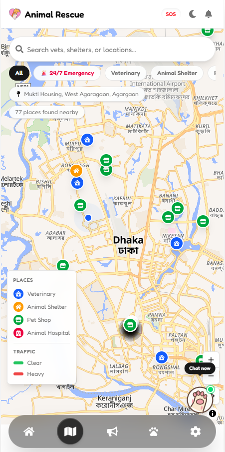
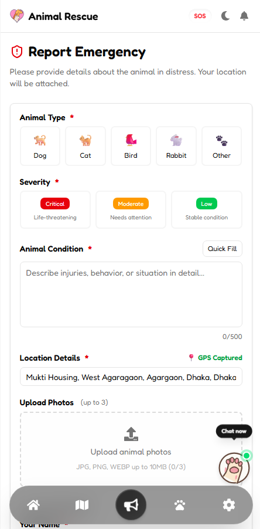
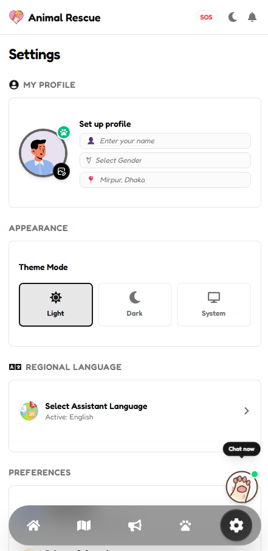

<div align="center">

---

<p align="center">
  
  
  
</p>

<p align="center">
  
  
  
</p>
</div>

<h2 align="center">📖 Table of Contents</h2>

| Section                                              | Description                                |
| :--------------------------------------------------- | :----------------------------------------- |
| 🏠 [Overview](#-overview)                            | Introduction to Animal Rescue Connect      |
| 📱 [Application Preview](#-application-preview)      | UI screenshots of the application          |
| 🚀 [Live Demo](#-live-demo)                          | Access the deployed application            |
| ❌ [Problem & Solution](#-the-problem--the-solution) | Challenges addressed and proposed solution |
| 💡 [Business Value](#-business-value--seo)           | Impact, benefits, and SEO strategy         |
| 🚀 [Key Features](#-key-features)                    | Core functionality of the platform         |
| 📋 [Project Phases](#-project-tasks--phases)         | Development roadmap and completed tasks    |
| 📦 [Tech Stack](#-tech-stack--architecture)          | Technologies and architecture overview     |
| 📁 [Project Structure](#-project-structure)          | Folder organization                        |
| 🛠️ [Installation](#-installation--setup)             | Local development setup                    |
| 🔑 [Environment Variables](#-environment-variables)  | Required configuration                     |
| 🚢 [Deployment](#-production-deployment)             | Production hosting information             |
| 🤝 [Contributing](#-social--contributing)            | Contributing guidelines and contact        |

<h2 align="center">✨ Overview</h2>

Animal Rescue Connect is a production-ready mobile-first rescue platform that enables users to instantly report sick, injured, or abandoned animals while connecting them with nearby veterinarians, shelters, rescue organizations, and volunteers using real-time geolocation services.

Built with Next.js 16, React 19, TypeScript, Tailwind CSS, and Redux Toolkit, the application combines emergency reporting, interactive mapping, route visualization, image uploads, and community-driven rescue coordination into a fast, accessible, and responsive experience.

---

<h2 align="center">🎯 Project Objectives</h2>

• Reduce rescue response time

• Enable GPS-based emergency reporting

• Improve volunteer coordination

• Provide nearby vet & shelter discovery

• Deliver an accessible mobile-first experience

• Demonstrate modern frontend architecture


<h2 align="center">🚀 **Live Link:** [https://animal-rescue-seven.vercel.app](https://animal-rescue-seven.vercel.app)</h2>

---

<h1 align="center">📱 Application Preview</h1>

<table align="center">
<tr>
<td align="center" valign="top">
<br>
<b>🏠 Home Dashboard</b>
</td>

<td align="center" valign="top">
<br>
<b>📍 Geolocation Map</b>
</td>

<td align="center" valign="top">
<br>
<b>🚨 Report Emergency</b>
</td>

<td align="center" valign="top">
<br>
<b>⚙️ Profile & Settings</b>
</td>
</tr>
</table>

---

<h2 align="center">❌ The Problem & ✅ The Solution</h2>

> **Stray and injured animals deserve immediate coordination.**

When an animal is in distress, traditional emergency response mechanisms are slow and fragmented. Communicating a precise street location is difficult, finding nearest open veterinary facilities takes precious time, and coordinating volunteer responses is highly disjointed.

| ❌ The Problem                                                 | ✅ Animal Rescue Connect's Solution                                       |
| :------------------------------------------------------------- | :------------------------------------------------------------------------ |
| Reporting animal emergencies is slow, with no central tracking | Instant reporting with animal type, severity, and photo uploads           |
| GPS location details are hard to communicate in text/calls     | Automatic GPS detection and manual marker adjustment on a live map        |
| Nearby shelters and vets are hard to locate in a panic         | Geolocation service finder showing vets, hospitals, and shelters on map   |
| Finding routes or directions to clinics takes crucial time     | Integrated route drawing with traffic conditions and distance calculation |
| Volunteer efforts are disjointed with no coordinate hub        | Volunteer sign-up with dynamic availability and location coordination     |

---

<h2 align="center">💡 Business Value & SEO</h2>

By balancing beautiful aesthetics with robust security, Animal Rescue Connect yields remarkable utility:

| Feature                       | Impact                                                                                 |
| :---------------------------- | :------------------------------------------------------------------------------------- |
| **Life-Saving Speed**         | Fast report submittal reduces emergency response time by minutes                       |
| **Eager Geolocation**         | Direct live navigation saves critical transit time to the nearest vet clinic           |
| **SEO & Access Optimization** | Search Engine indexing and semantic structures maximize organic reach for lost animals |
| **Resource Efficiency**       | Active volunteer tracking prevents duplicate rescues and coordinates responses         |

---

<h2 align="center">🚀 Key Features</h2>

| 🚨 **Emergency Reporting** | 🗺️ **Geolocation**       |
| :------------------------- | :----------------------- |
| ✔️ Photo Upload            | ✔️ Interactive Maps      |
| ✔️ GPS Detection           | ✔️ Live Route Navigation |
| ✔️ Severity Selection      | ✔️ Nearby Vet Discovery  |
| ✔️ Animal Category         | ✔️ Shelter Discovery     |

| 🤝 **Volunteer System**   | 📊 **Analytics Dashboard** |
| :------------------------ | :------------------------- |
| ✔️ Volunteer Registration | ✔️ Interactive Charts      |
| ✔️ Rescue Coordination    | ✔️ Community Statistics    |
| ✔️ Participation Tracking | ✔️ Rescue Trends           |
| ✔️ Availability Status    | ✔️ Response Metrics        |

---

<h2 align="center">📋 Project Tasks & Phases</h2>

<h3 align="center">Phase 1 - Animal Reporting & Location Tracking Foundation</h3>

- **Project Setup**
  - [x] Next.js project bootstrap with TypeScript & Tailwind CSS
  - [x] Clean directory structure & mobile-first design configuration
- **Homepage Development**
  - [x] Quick action report button
  - [x] Emergency help & immediate assistance guidelines
  - [x] Dynamic nearby rescue overview card
- **Animal Reporting Module**
  - [x] Photo upload integration with Cloudinary widget
  - [x] Detailed fields for condition, type, and severity selection
- **Geolocation Integration**
  - [x] Automatic GPS-based location detection
  - [x] Location permission handling and manual marker adjustment
- **Report Details Page**
  - [x] Uploaded image preview carousel
  - [x] Detailed case status, reporter name, and share options
- **Mobile Experience**
  - [x] Responsive layouts tailored for smartphones, tablets, and desktop

---

<h3 align="center">Phase 2 - Vet & Shelter Discovery System</h3>

- **Nearby Services Module**
  - [x] List veterinarians, animal hospitals, rescue centers, and shelters
- **Interactive Map Integration**
  - [x] Live markers for verified animal services
  - [x] OSRM route drawing with color-coded traffic overlay (Red/Green)
  - [x] Interactive popup cards with ratings, directions button, and address
- **Advanced Search & Filtering**
  - [x] Filter service list by type (Vet, Shelter, Hospital, Pet Shop)
  - [x] Filter by 24/7 availability
  - [x] Location search autocompletion
- **Service Details Page**
  - [x] Detailed view of contact info, hours, website, and phone
- **Emergency Contact Features**
  - [x] One-tap direct phone calls
  - [x] Direct messaging UI
- **Rescue Dashboard**
  - [x] Manage submitted cases, update status, and track Redux state

---

<h3 align="center">Phase 3 - Rescue Coordination & Analytics</h3>

- **Volunteer Coordination**
  - [x] Sign-up form with skills, availability, and preferences
  - [x] Active participation tracking in nearby cases
- **Community & Leaderboards**
  - [x] Live community board showing recent activities
  - [x] Contribution counter and leaderboards
- **Analytics Dashboard**
  - [x] Interactive charts built with Recharts (Monthly Rescues, Adoption Rate)
  - [x] Key Performance Indicators (Total Rescues, Active Volunteers, Avg Response Time)
- **Production Optimization**
  - [x] TypeScript compiler error checking
  - [x] Security measures (Inspect elements & drag-and-drop disabled)
  - [x] Deployment pipeline configuration on Vercel

---

<h2 align="center">📦 Tech Stack & Architecture</h2>

| Technology           | Category           | Purpose / Notes                                       |
| :------------------- | :----------------- | :---------------------------------------------------- |
| **Next.js 16**       | Frontend Framework | App Router, Server Components & SEO                   |
| **React 19**         | Library            | Concurrent rendering, modern hooks                    |
| **TypeScript**       | Language           | Strict type safety across components and store        |
| **Tailwind CSS 4**   | Styling            | Modern, fast utility-first styling system             |
| **Shadcn UI**        | UI Primitives      | Accessible and fully customizable base components     |
| **Redux Toolkit**    | State Management   | Centralized store for user profile and active reports |
| **React Hook Form**  | Form Handling      | Performant form state management                      |
| **Zod**              | Validation         | Strict schema validation for inputs                   |
| **Axios**            | API Client         | HTTP requests for external services                   |
| **MapLibre GL**      | Maps               | High-performance OpenStreetMap vector rendering       |
| **Overpass API**     | Geolocation        | Live queries for nearby vets/shelters                 |
| **Nominatim**        | Geolocation        | Reverse geocoding (coordinates to address)            |
| **OSRM**             | Routing            | Route path creation with traffic-aware colors         |
| **Cloudinary**       | Image Hosting      | Next-Cloudinary widget for user photo uploads         |
| **Socket.io Client** | Real-time          | Configured socket hooks (backend ready)               |
| **React Toastify**   | Notifications      | User-friendly alert and progress toast displays       |
| **Lucide React**     | Icons              | Modern and consistent iconography                     |
| **Vercel**           | Deployment         | Automated deployments and hosting                     |

---

<h2 align="center">📁 Project Structure</h2>

```
src/
├── app/                          # Next.js App Router pages
│   ├── analytics/                # Community analytics dashboard
│   ├── community/                # Community board
│   ├── map/                      # Interactive rescue map
│   ├── report/                   # Emergency report submission
│   ├── rescues/                  # Rescue listings & detail pages
│   ├── services/                 # Vet/shelter service pages
│   ├── settings/                 # Settings, notifications, privacy
│   ├── volunteer/                # Volunteer registration
│   ├── layout.tsx                # Root layout & providers
│   └── page.tsx                  # Home page
│
├── components/
│   ├── forms/                    # ReportForm, VolunteerForm
│   ├── layout/                   # Header, BottomNav
│   ├── map/                      # MapView (complex map component)
│   ├── providers/                # ThemeProvider, ReduxProvider, PermissionBootstrap
│   └── ui/                       # Atomic UI: Button, Card, Dialog, Badge, etc.
│
├── hooks/                        # Custom React hooks
├── lib/                          # API clients, schemas, utilities
├── store/                        # Redux store, slices, typed hooks
└── types/                        # Shared TypeScript definitions
```

---

<h2 align="center">🛠️ Installation & Setup</h2>

<h3 align="center">Prerequisites</h3>

- Node.js `v18+`
- npm or yarn

<h3 align="center">Installation</h3>

```bash
# 1. Clone the repository
git clone https://github.com/CoderGUY47/animal-rescue.git
cd animal-rescue

# 2. Install dependencies
npm install

# 3. Set up environment variables
cp .env.example .env
# Fill in your Cloudinary keys

# 4. Start the development server
npm run dev
```

Open [http://localhost:3000](http://localhost:3000) in your browser.

---

<h2 align="center">🔑 Environment Variables</h2>

```env
NEXT_PUBLIC_CLOUDINARY_CLOUD_NAME=
NEXT_PUBLIC_CLOUDINARY_UPLOAD_PRESET=
NEXT_PUBLIC_CLOUDINARY_API_KEY=
NEXT_PUBLIC_SOCKET_URL=
FOURSQUARE_API_KEY=

```

---

<h2 align="center">🚢 Production Deployment</h2>

- **Frontend Hosting (Next.js):** Deployed on **Vercel** (`animal-rescue-seven.vercel.app`).
- **Deployment Pipeline:** Automatic CI/CD pipeline integrated directly via GitHub.

---

<h2 align="center">🤝 Social & Contributing</h2>

Contributions, feature suggestions, and issue reports are always welcome!

If you'd like to improve **Animal Rescue Connect**, please feel free to:

- 🍴 Fork the repository
- 🌱 Create a new feature branch
- 💡 Commit your improvements
- 🚀 Submit a Pull Request
- 🐞 Report bugs or request new features through GitHub Issues

---

<h3 align="center">👨‍💻 Developed By</h3>

<p align="center">
  
  <a href="https://github.com/CoderGUY47"></a>
  <a href="https://www.linkedin.com/in/dev-s-hasan/"></a>
  <a href="mailto:s.m.hasan4599@gmail.com"></a>
</p>
